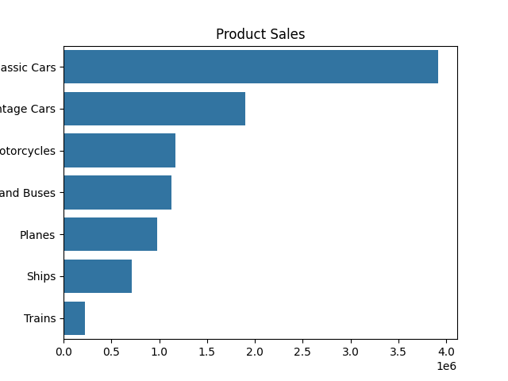
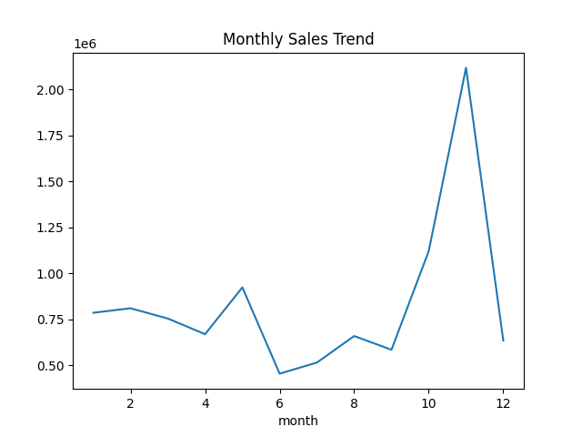
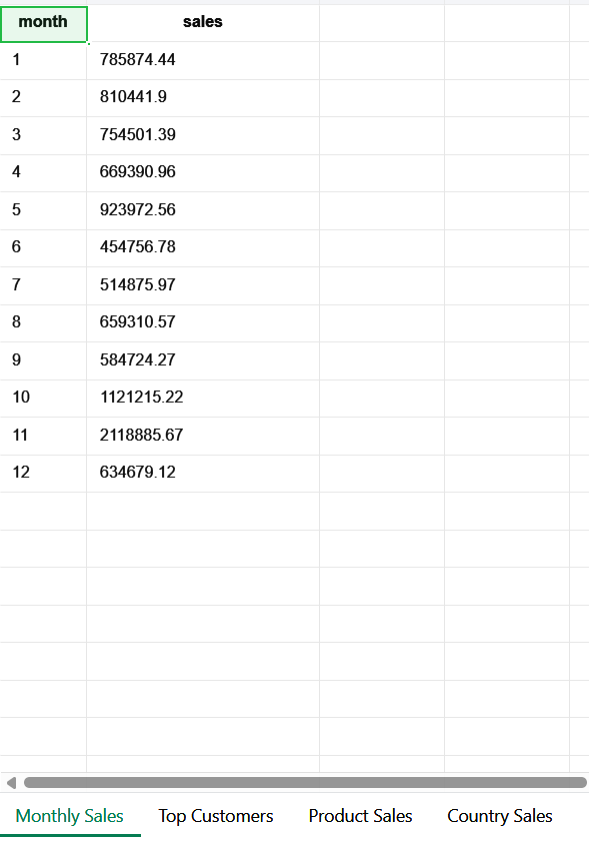
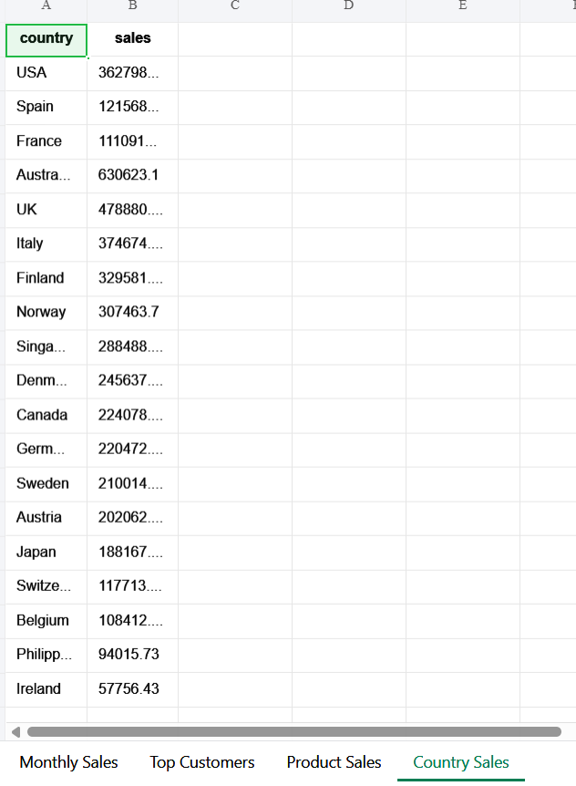
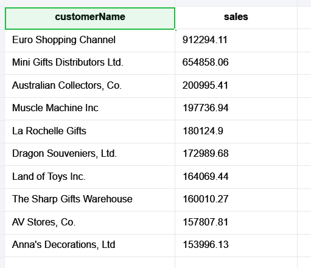
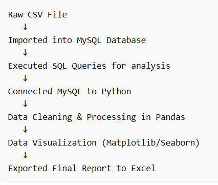

# E-Commerce Sales Analysis Project

## Project Overview
This project analyzes e-commerce sales data using MySQL and Python to identify sales trends, top-performing products, and key business insights.

## Tools Used
- MySQL (Database)
- Python (Pandas, Matplotlib, Seaborn)
- Excel (Reporting)
- VS Code

## Dataset
- 2823 sales records
- Includes product, customer, country, and date information

## Key Analysis Performed

### Monthly Sales Analysis
- Highest sales in November (~2.1M)
- Lowest sales in June (~450K)

### Product Performance
- Classic Cars generate highest revenue
- Vintage Cars second best
- Trains lowest

### Customer and Country Analysis
- Identified top customers contributing highest revenue
- Identified top countries driving sales

## Excel Output Report

Generated automated Excel report using Python.

## Product Sales Chart

## Monthly Sales Chart

## Monthly Sales 

## Country Sales 

## Top Customers 

 
 ## Product Sales
 

## Project Workflow
 

## Files in Project

dataset/ → Raw dataset  
sql/ → SQL queries  
python/ → Python analysis script  
excel/ → Excel output and charts  

## Outcome

Built a complete data analysis pipeline using SQL and Python to generate business insights.
